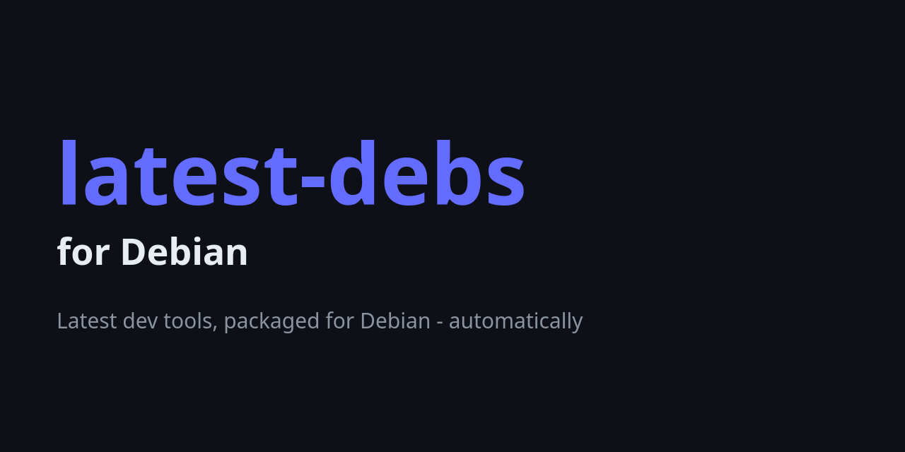

# sd for Debian

[chmln/sd](https://github.com/chmln/sd) — Intuitive find __DESCRIPTION__ replace CLI (sed alternative) —
packaged for Debian as part of [latest-debs](https://github.com/latest-debs).

Want your own project packaged and maintained this way? See the
[latest-debs packaging service](https://github.com/latest-debs/apt-repo/blob/main/SERVICE.md).

## Install

Via the latest-debs apt repository:

```sh
sudo extrepo enable latest-debs
sudo apt update
sudo apt install sd
```

Or download a `.deb` from the [Releases](https://github.com/latest-debs/sd-debian/releases) page:

```sh
sudo dpkg -i sd_*.deb
```

## Supported distributions & architectures

- Debian Bullseye (11), Bookworm (12), Trixie (13), Forky (14/testing), Sid (unstable)
- amd64, arm64, armhf, i386, armel, loong64, ppc64el, riscv64, s390x —
  whichever architectures chmln/sd actually publishes a Linux
  binary for

## Disclaimer

Unofficial, volunteer-run packaging — **best-effort, no SLA**.

- **Update cadence:** publishing a release normally triggers an immediate
  apt-repo rebuild via webhook; the ~6h scheduled run is the fallback. GitHub
  outages, a missing trigger token, rate limits, or upstream archive changes
  can delay or skip an update; there is no freshness guarantee.
- **Draft releases:** every build is published as a *draft* that a maintainer
  reviews before promoting, so a new version can lag its build.

For issues with sd itself, see
[chmln/sd](https://github.com/chmln/sd).
